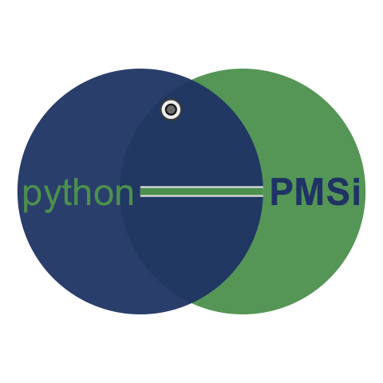
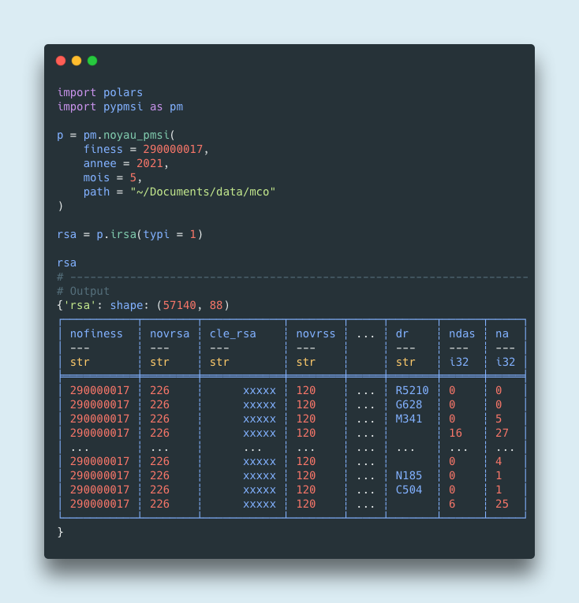

# pypmsi : lire des fichiers PMSI avec python / pola.rs


Lire les fichiers du PMSI avec python / pola.rs

<center></center>


## Installation


```sh
git clone https://github.com/GuillaumePressiat/pypmsi.git
poetry install
```

avec pip

```sh
pip install https://github.com/GuillaumePressiat/pypmsi/releases/latest/download/pypmsi-0.2.9-py3-none-any.whl
```


## Exemple



## Contexte introductif


Le [PMSI](https://fr.wikipedia.org/wiki/Programme_de_médicalisation_des_systèmes_d%27information), programme de médicalisation des systèmes d'information, repose sur l'envoi par les établissements de santé de fichiers anonymisés à l'[ATIH](https://www.atih.sante.fr) (agence technique de l'information sur l'hospitalisation). Ces fichiers respectent des formats dits ministériels qui évoluent d'année en année.

Ces fichiers contiennent beaucoup de données qui sont utiles dans les hôpitaux pour :

- décrire l'activité de l'hôpital tant sur un volet prise en charge (diagnostics : CIM-10 et autres, actes médicaux/techniques : CCAM, CSARR) que sur un volet médico-économique (GHM, GHS, GME, GMT), ce domaine est vaste
- analyser les parcours de soins des patients au sein d'un groupement hospitalier (entre différentes disciplines, champs d'activité MCO, SSR, Psy, HAD)
- constituer un entrepôt de données PMSI figées dans le temps et décorrélées de la donnée de production à l'échelle d'un groupement hospitalier, que l'on peut utiliser comme bassin de données pour la recherche mais aussi pour alimenter un système d'information décisionnel

Ces données sont donc pertinentes pour de multiples acteurs dans l'hôpital (médecins, chercheurs, statisticiens, décideurs, administratifs).

